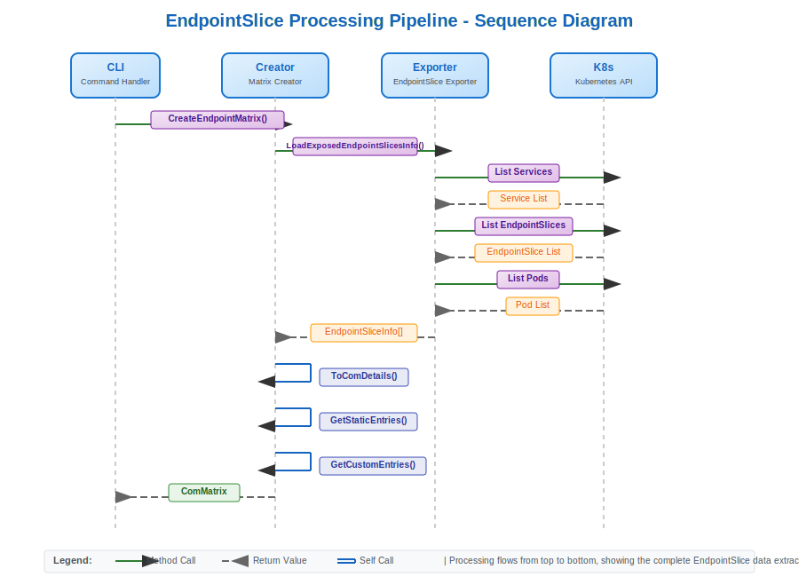
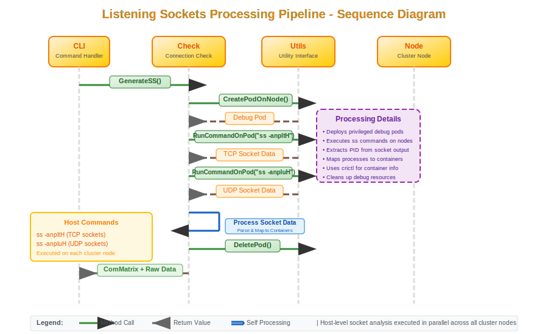

# Commatrix Design Document

## Summary

Commatrix is a sophisticated Go-based tool designed to automatically generate accurate and up-to-date communication flow matrices for OpenShift clusters. It provides comprehensive network flow documentation by analyzing Kubernetes EndpointSlices and host-level listening sockets, making it invaluable for security audits, network planning, and operational documentation.

**Target Audience:** Architects, Developers, Quality Engineers, and Support Engineers

---

## 1. Architecture Overview

### High-Level Architecture

Commatrix follows a modular, layered architecture designed for extensibility and maintainability:

```
┌─────────────────────────────────────────────────────────────┐
│                    CLI Interface Layer                      │
├─────────────────────────────────────────────────────────────┤
│                   Command Generation                        │
│                     (cmd/generate)                          │
├─────────────────────────────────────────────────────────────┤
│                    Core Business Logic                      │
│  ┌─────────────────┐  ┌──────────────┐  ┌─────────────────┐ │
│  │  Matrix Creator │  │  Matrix Diff │  │  Output Format  │ │
│  │     Package     │  │   Package    │  │    Package      │ │
│  └─────────────────┘  └──────────────┘  └─────────────────┘ │
├─────────────────────────────────────────────────────────────┤
│                   Data Collection Layer                     │
│  ┌─────────────────┐                    ┌─────────────────┐ │
│  │  EndpointSlices │                    │ Listening       │ │
│  │    Exporter     │                    │ Sockets Analyzer│ │
│  └─────────────────┘                    └─────────────────┘ │
├─────────────────────────────────────────────────────────────┤
│                  Infrastructure Layer                       │
│  ┌─────────────────┐  ┌──────────────┐  ┌─────────────────┐ │
│  │   Kubernetes    │  │    Utils     │  │     Types       │ │
│  │     Client      │  │   Package    │  │   Package       │ │
│  └─────────────────┘  └──────────────┘  └─────────────────┘ │
└─────────────────────────────────────────────────────────────┘
```

### Core Components

#### 1. CLI Interface (`cmd/main.go`, `cmd/generate/`)
 > Provides command-line interface for matrix generation. This ia a Cobra-based command, with debug logging capabilities and custom entries integration. It gives multiple output formats (CSV, JSON, YAML, NFTables).

#### 2. Matrix Creator (`pkg/commatrix-creator/`)
>Orchestrates communication matrix creation by combining EndpointSlice data with static entries. It also integrates custom user-defined entries and manages platform-specific configurations

#### 3. EndpointSlices Exporter (`pkg/endpointslices/`)
>Extracts network communication data from Kubernetes EndpointSlices. It also analyzes exposed services (NodePort, LoadBalancer, hostNetwork) and determines node roles for traffic flows.

#### 4. Listening Sockets Analyzer (`pkg/listening-sockets/`)
>Provides real-time host-level port analysis by executing `ss` command on cluster nodes and correlating processes with container information. It generates host-open-ports matrix.

#### 5. Matrix Diff (`pkg/matrix-diff/`)
>Compares different communication matrices by identifying unique entries between matrices, generating diff reports for validation. It also supports operational change tracking

---

## 2. System Design

### 2.1 Data Flow Architecture



### 2.2 Component Interactions

#### A. Primary Data Flow

The system executes a logical sequence of operations to generate communication matrices. The workflow follows these main stages:

**1. System Initialization**

The process begins with command processing and environment setup:

- **CLI Processing**: `main.go` processes command-line arguments and delegates to the generate handler
- **Parameter Validation**: Validates output formats, custom entry configurations, and creates output directories  
- **Platform Detection**: Determines deployment type (SNO vs Standard) and platform type (AWS/BareMetal/None)
- **Component Setup**: Initializes Kubernetes client, EndpointSlice exporter, and Matrix Creator with platform configuration

**2. EndpointSlice Data Collection**

The core data gathering phase extracts network information from the Kubernetes API:

- **Service Discovery**: Queries all Services across namespaces
- **EndpointSlice Retrieval**: Gets EndpointSlices associated with each service using label selectors
- **Pod Correlation**: Lists pods matching service selectors to establish container relationships
- **Exposure Analysis**: Filters for exposed services (NodePort, LoadBalancer, hostNetwork pods)
- **Data Transformation**: Converts EndpointSlice data into standardized `ComDetails` structures

**3. Matrix Assembly**

Combines data from multiple sources into a unified communication matrix:

- **Static Entry Integration**: Adds platform-specific communication rules based on detected platform and deployment type
- **Custom Entry Processing**: Optionally loads and merges user-defined entries from CSV/JSON/YAML files
- **Data Consolidation**: Combines EndpointSlice data, static entries, and custom entries
- **Deduplication**: Removes duplicate entries and sorts the matrix for consistent output

**4. Host-Level Validation** *(Optional)*

When `--host-open-ports` flag is enabled, performs real-time socket analysis:

- **Debug Environment**: Creates temporary namespace and deploys privileged debug pods on each cluster node
- **Parallel Socket Analysis**: Executes `ss -anpltH` (TCP) and `ss -anpluH` (UDP) commands across all nodes simultaneously
- **Process Mapping**: Maps socket processes to containers using `crictl` and cgroup information
- **Validation Matrix**: Generates separate matrix based on actual listening sockets
- **Comparison Analysis**: Creates diff report showing discrepancies between EndpointSlice and socket matrices
- **Resource Cleanup**: Removes temporary debug pods and namespaces

**5. Output Generation**

Produces final artifacts in requested formats:

- **Format Conversion**: Transforms matrix data to requested format (CSV, JSON, YAML, NFTables)
- **File Generation**: Writes multiple output files:
  - Primary communication matrix
  - Socket-based matrix (if host validation enabled)
  - Matrix diff report (if host validation enabled)  
  - Raw socket data files (TCP and UDP)
- **Role-Based Processing**: For NFTables format, creates separate rule files for master and worker nodes

#### B. Error Handling Strategy
- **Graceful Degradation**: Missing EndpointSlice owner references logged but don't halt execution
- **Retry Logic**: Network operations include timeout and retry mechanisms
- **Validation**: Input validation at multiple layers prevents malformed data propagation

### 2.3 Concurrency Design

The system leverages Go's concurrency primitives for optimal performance:

- **Parallel Node Processing**: `errgroup` coordinates concurrent node analysis
- **Mutex Protection**: Shared data structures protected during concurrent access
- **Resource Cleanup**: Deferred cleanup ensures temporary resources are properly removed

---

## 3. Design Decisions

### A. Technology Choices

#### Go Language Selection
**Rationale**: 

- Native Kubernetes ecosystem support
- Excellent concurrency primitives
- Strong standard library for network operations
- Mature testing frameworks (Ginkgo/Gomega)

#### Controller-Runtime Client
**Rationale**:

- Unified client interface for multiple Kubernetes APIs
- Built-in caching and optimization
- Consistent with modern Kubernetes tooling patterns

#### Cobra CLI Framework
**Rationale**:

- Industry standard for Go CLI applications
- Built-in help generation and validation
- Consistent with kubectl and other Kubernetes tools

### B. Architectural Patterns

#### Dependency Injection
- **Implementation**: Constructor functions accept interface dependencies
- **Benefits**: Testability, modularity, mock-friendly design
- **Example**: `utils.UtilsInterface` enables comprehensive testing

#### Interface-Based Design
- **Implementation**: Core functionality exposed through well-defined interfaces
- **Benefits**: Loose coupling, easier testing, extensibility
- **Example**: `UtilsInterface` abstracts Kubernetes operations

#### Strategy Pattern
- **Implementation**: Platform-specific static entries selection
- **Benefits**: Easy addition of new platforms, clear separation of concerns
- **Example**: Platform type determines which static entries to include

### C. Data Structure Design

#### ComDetails Structure
```go
type ComDetails struct {
    Direction string // Traffic direction (currently ingress only)
    Protocol  string // IP protocol (TCP/UDP/SCTP)
    Port      int    // Port number
    Namespace string // Kubernetes namespace
    Service   string // Service name
    Pod       string // Pod name
    Container string // Container name
    NodeRole  string // Node role (master/worker)
    Optional  bool   // Whether flow is optional for OpenShift
}
```

**Design Rationale**:
- **Comprehensive Coverage**: Captures all relevant network flow metadata
- **Serialization Support**: Multiple format tags enable flexible output
- **Kubernetes Native**: Aligns with Kubernetes resource concepts

#### ComMatrix Structure
```go
type ComMatrix struct {
    Matrix []ComDetails
}
```

**Design Rationale**:
- **Simplicity**: Wraps slice with behavior methods
- **Extensibility**: Easy to add matrix-level operations
- **Performance**: Direct slice access for high-performance operations

---

## 4. Data Flow and Processing

### A. EndpointSlice Processing Pipeline



### B. Listening Sockets Processing Pipeline



### C. Data Transformation Flow

1. **Raw Data Collection**: 
   - EndpointSlices from Kubernetes API
   - Socket information from `ss` command output

2. **Data Normalization**:
   - Extract relevant ports and services
   - Map containers to processes
   - Resolve node roles

3. **Data Enrichment**:
   - Add platform-specific static entries
   - Incorporate custom user entries
   - Apply filtering rules

4. **Data Validation**:
   - Remove duplicates using set operations
   - Sort for consistent output
   - Validate against documented matrices

---

## 5. Testing Strategy and Quality Assurance

### A. Testing Architecture

Commatrix implements a comprehensive testing strategy with multiple layers:

#### Unit Testing
- **Framework**: Ginkgo BDD + Gomega assertions
- **Coverage**: All core business logic packages
- **Mock Strategy**: Generated mocks using `golang/mock`
- **Key Features**:
  - Behavior-driven test specifications
  - Table-driven testing for multiple scenarios
  - Mock-based isolation of external dependencies

**Example Test Structure**:
```go
var _ = Describe("Commatrix creator pkg tests", func() {
    Context("Get Custom entries List From File", func() {
        for _, format := range []string{types.FormatCSV, types.FormatJSON, types.FormatYAML} {
            It(fmt.Sprintf("Should successfully extract ComDetails from a %s file", format), func() {
                // Test implementation
            })
        }
    })
})
```

#### Integration Testing
- **Framework**: End-to-end test suite in `test/e2e/`
- **Scope**: Full workflow validation including cluster interaction
- **Key Test Cases**:
  - Matrix generation accuracy validation
  - Host open ports correlation verification
  - Platform-specific behavior validation

#### Validation Testing
- **Purpose**: Ensures generated matrices match documented specifications
- **Implementation**: Automated comparison against reference matrices
- **Features**:
  - Diff generation for troubleshooting
  - Platform-specific validation rules
  - Ignore patterns for known dynamic ports

### B. Quality Measures

#### Code Quality Tools
- **Linting**: `golangci-lint` with comprehensive rule set
- **Formatting**: Standard Go formatting with `go fmt`
- **Dependency Management**: `go mod` with version pinning

#### Build and Release Quality
- **Cross-Platform Building**: Support for multiple OS/architecture combinations
- **Makefile Automation**: Standardized build, test, and release processes
- **Artifact Generation**: Consistent output file naming and organization

#### Mock-Based Testing Strategy
- **Interface Mocking**: All external dependencies mocked for unit tests
- **Behavior Verification**: Mocks verify expected interaction patterns
- **State Isolation**: Each test runs in isolated environment

**Mock Usage Example**:
```go
mockUtils.EXPECT().RunCommandOnPod(gomock.Any(),
    []string{"/bin/sh", "-c", "ss -anpltH"}).
    Return([]byte(tcpExecCommandOutput), nil).AnyTimes()
```

### C. Test Data Management

#### Test Fixtures
- **Static Test Data**: Predefined Kubernetes resources for consistent testing
- **Sample Entries**: Example custom entries in multiple formats
- **Reference Matrices**: Known-good matrices for validation

#### Test Environment Setup
- **Fake Clients**: Kubernetes fake clients for isolated testing
- **Mock Controllers**: Gomock controllers for dependency simulation
- **Test Helpers**: Shared utilities for test setup and teardown

---

## 6. Operational Considerations

### A. Performance Characteristics

#### Scalability
- **Concurrent Processing**: Parallel node analysis reduces execution time
- **Memory Efficiency**: Streaming processing of large datasets
- **Resource Cleanup**: Automatic cleanup of temporary debug pods

#### Platform Support
- **Deployment Types**: Single Node OpenShift (SNO) and Standard clusters
- **Platform Types**: AWS, BareMetal, and None platform types
- **Kubernetes Versions**: Compatible with modern Kubernetes/OpenShift versions

### B. Security Model

#### Privilege Requirements
- **RBAC**: Requires read access to cluster resources
- **Privileged Pods**: Creates temporary privileged pods for host analysis
- **Network Access**: Needs cluster network connectivity

#### Data Handling
- **Sensitive Information**: Does not persist sensitive cluster data
- **Temporary Resources**: Automatic cleanup of debug resources
- **Output Security**: Generated matrices contain network topology information

### C. Extensibility

#### Custom Entries Support
- **Multiple Formats**: Support for CSV, JSON, YAML custom entries
- **Validation**: Input validation for custom entry formats
- **Integration**: Seamless merging with discovered entries

#### Output Format Flexibility
- **Standard Formats**: CSV, JSON, YAML for data interchange
- **Specialized Formats**: NFTables format for firewall configuration
- **Extensible Design**: Easy addition of new output formats

---

## 7. Future Considerations

### A. Potential Enhancements

#### Additional Traffic Directions
- **Egress Analysis**: Extend beyond current ingress-only focus
- **Inter-Pod Communication**: Analysis of pod-to-pod traffic flows
- **External Dependencies**: Mapping of external service dependencies

#### Enhanced Visualization
- **Network Diagrams**: Graphical representation of communication flows
- **Interactive Dashboards**: Web-based matrix exploration
- **Trend Analysis**: Historical communication pattern analysis

#### Integration Capabilities
- **CI/CD Integration**: Automated validation in deployment pipelines
- **Security Scanning**: Integration with security policy validation
- **Monitoring Integration**: Real-time communication flow monitoring

### B. Technical Debt and Improvements

#### Known Limitations
- **IPv6 Support**: Currently focused on IPv4 networking
- **Dynamic Port Handling**: Some dynamic ports require manual filtering
- **Large Cluster Performance**: Potential optimization opportunities for very large clusters

#### Architectural Evolution
- **Microservice Architecture**: Potential decomposition for larger deployments
- **Event-Driven Updates**: Real-time matrix updates based on cluster changes
- **Plugin Architecture**: Extensible plugin system for custom data sources

---

## 8. Conclusion

Commatrix represents a well-architected solution for OpenShift network flow documentation. Its modular design, comprehensive testing strategy, and flexible output options make it valuable for architects and engineers managing complex Kubernetes environments.

**Key Strengths**:

- **Accuracy**: Combines multiple data sources for comprehensive coverage
- **Automation**: Eliminates manual network documentation effort
- **Validation**: Built-in verification against host-level reality
- **Flexibility**: Multiple output formats and customization options

**Recommended Use Cases**:

- Security audit preparation and compliance reporting
- Network policy development and validation  
- Operational documentation and troubleshooting
- Change impact analysis for network modifications

The system's architecture supports both current operational needs and future extensibility requirements, making it a robust foundation for ongoing network visibility initiatives.
